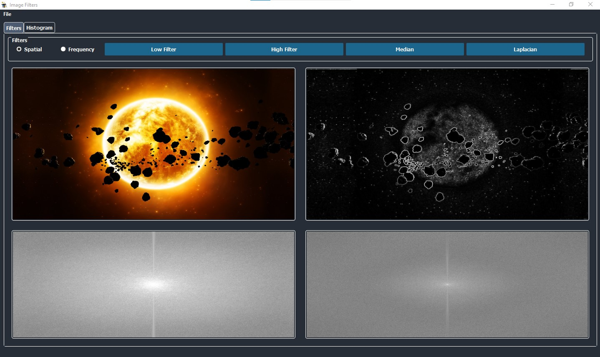
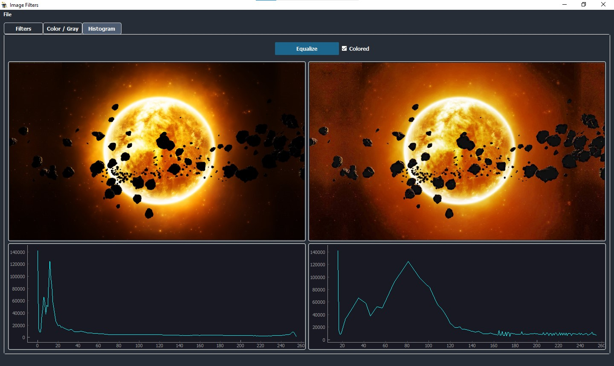
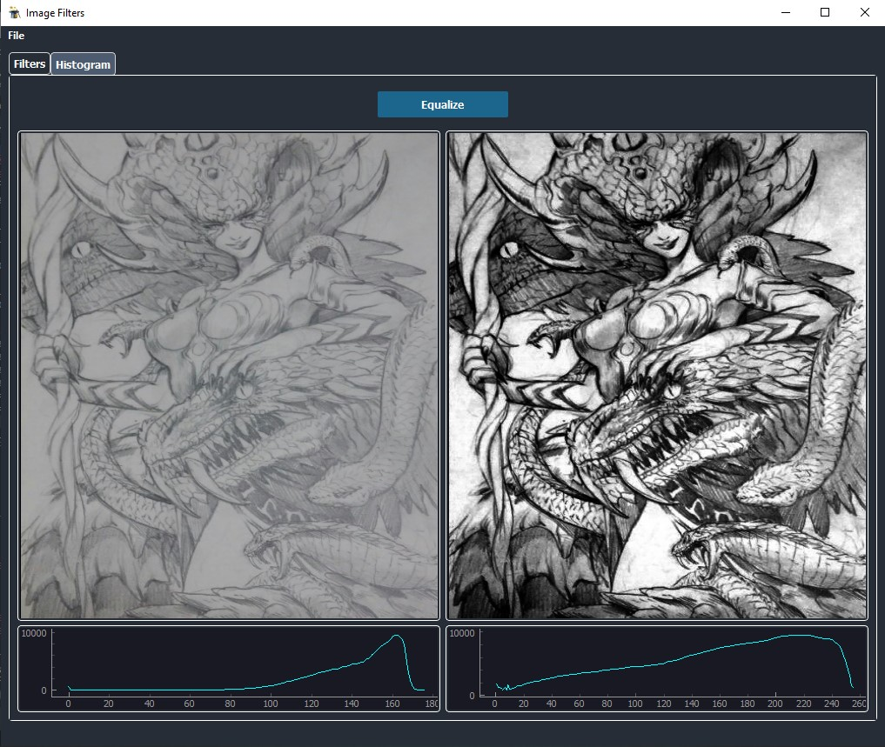
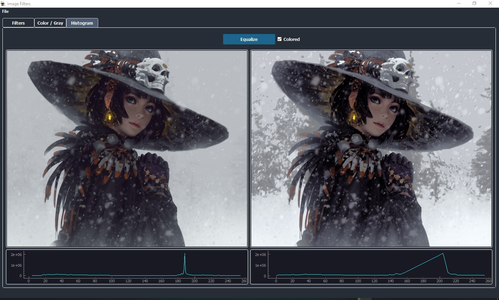
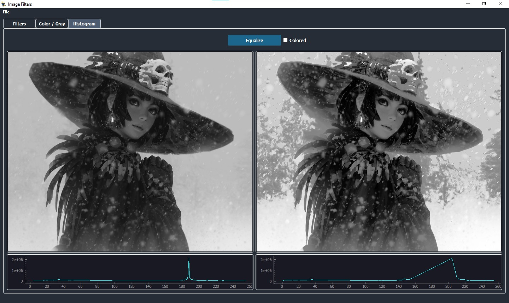

# Image Filters

> *all credit goes to filo, mariam & mariam*
__________________
A simple Python application with GUI that utilizes various built-from-scratch filters to edit any desired photo and displays the output in grayscale. The filters used are divided into two categories that can be switched between easily using radio buttons; spatial domain and frequency domain filters.
The app also includes a histogram equalization tool separated into a second tab.

## Samples
The first screen is composed of filter options along with four Labels to display original and filtered images for the top Labels, then the original and filtered in the frequency domain for the Labels below.  

* Median Filter (spatial domain)

 
      

* Laplacian Filter (spatial domain)

 
    

* Low Pass Filter (frequency domain)

 
      

* High Pass Filter (frequency domain)

 
      
     

* Histogram Equalization

 *recently added colors*

 
      
      
     

 
      
     

## Deeper Insight

*to-be-added-later*
### Code Snippets
*to-be-added-later* 

### Libraries
*to-be-added-later*

## Issues
*to-be-added-later*

## Contributors

Name | Github
------|----------
Filobater George | FilobaterGeorge
Mariam Boghdady | 
Mariam Mahmoud | 
Mohamed Osama | osama51

______________
