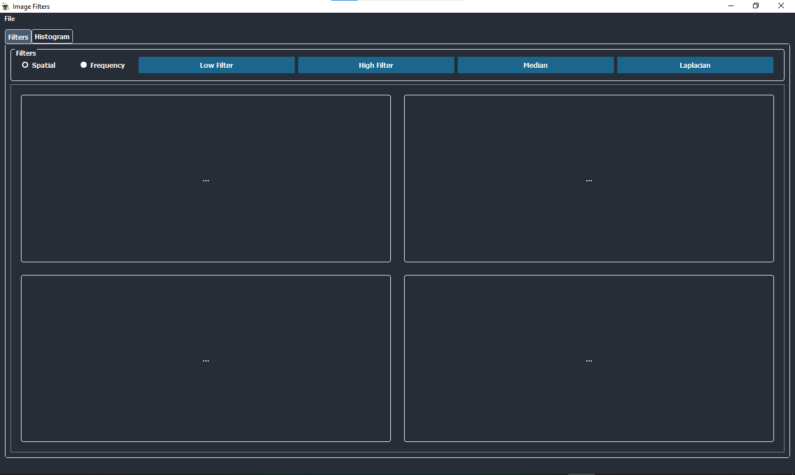
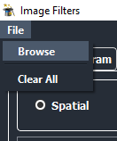
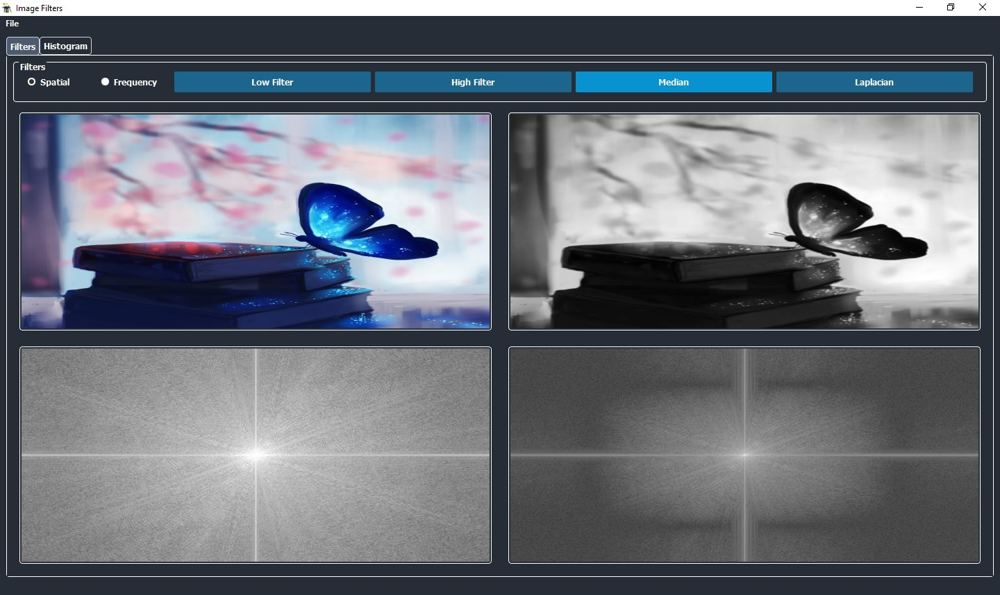
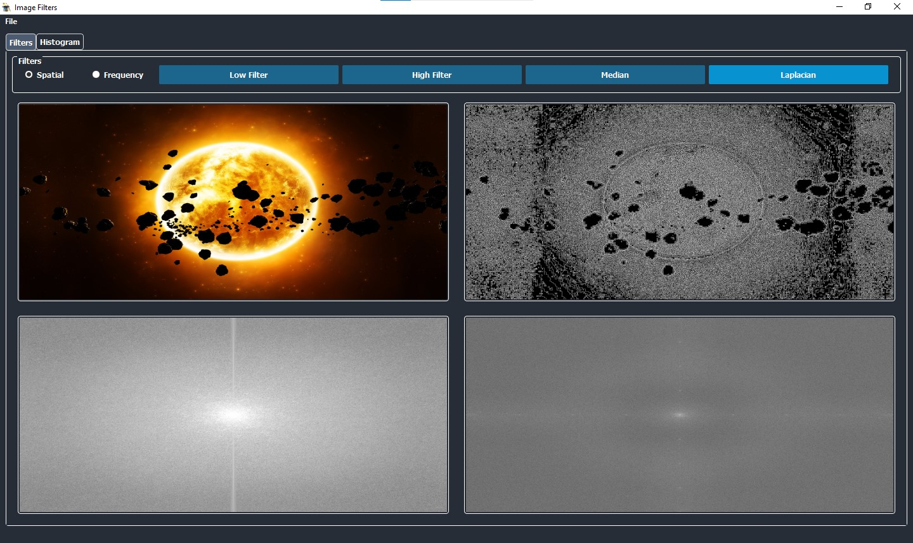
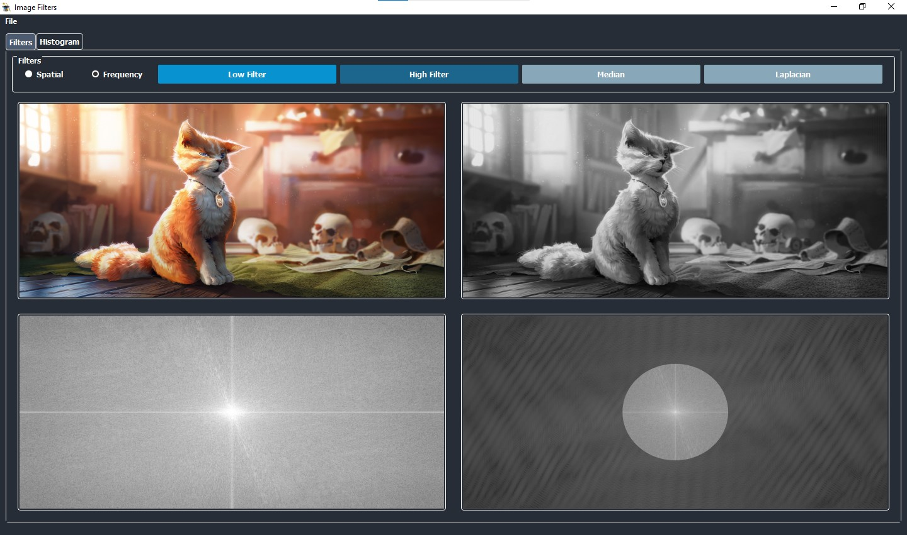
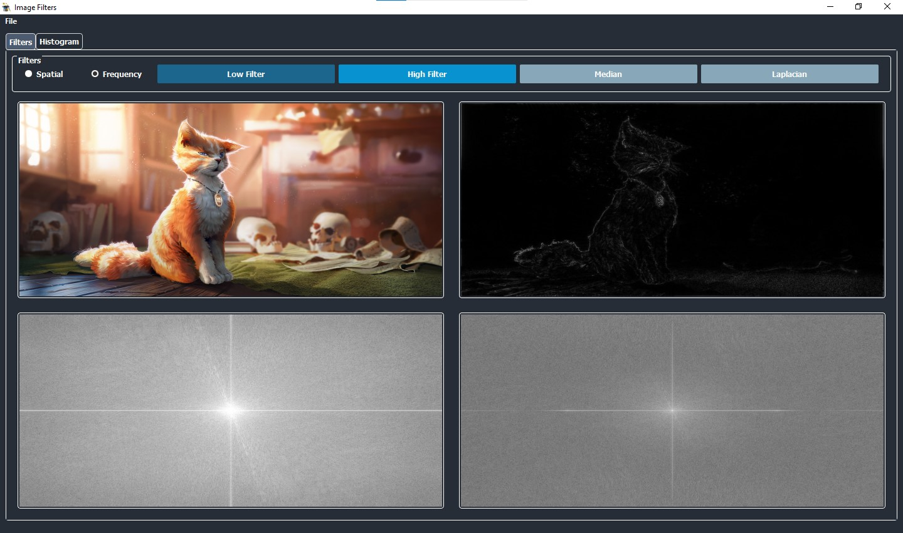
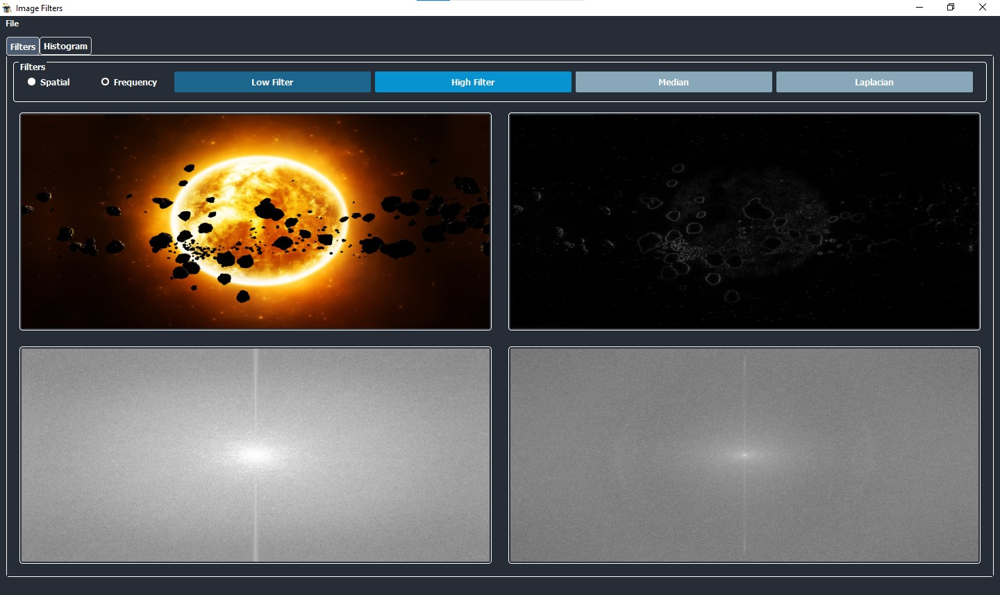
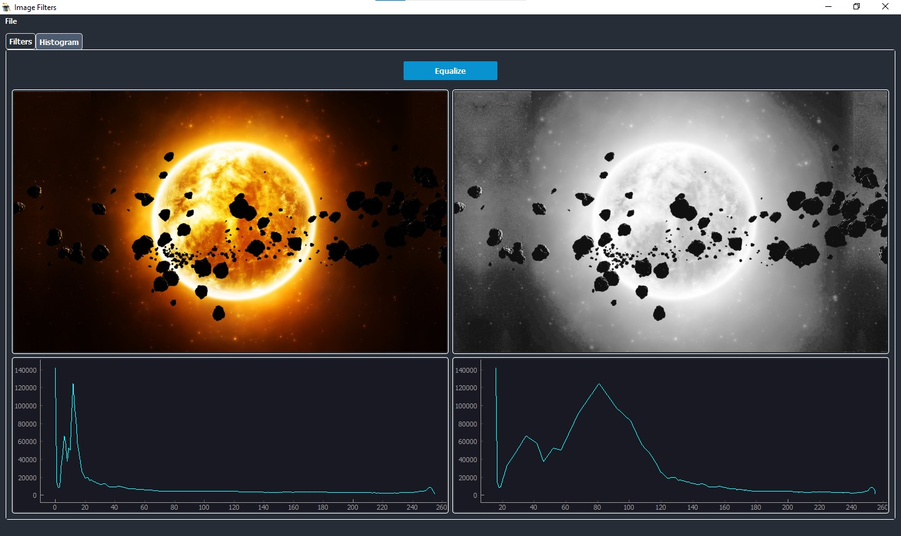
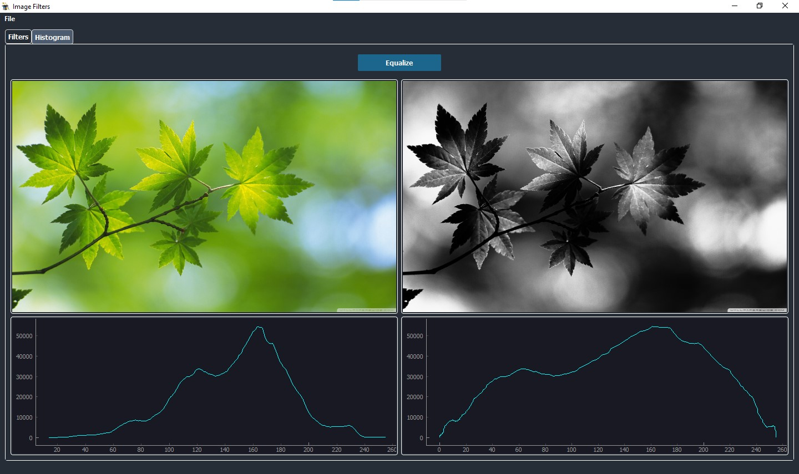

# Image Filters

## Contributers

Name | Github
------|----------
Filobater George | FilobaterGeorge
Mariam Boghdady | 
Mariam Mahmoud | 
Mohamed Osama | osama51

``` all credit goes to filo, mariam & mariam ```
__________________
## Abstract 
A simple python application with gui that utilizes various built-from-scratch filters to edit any desired photo and displays the output in gray scale. The filters used are divided into two categories that can be switched between easily using radio buttons; spatial domain and frequency domain filters.
The app also includes a a histogram equalization tool separated in a second tab. The tool offers 

## Samples
First screen is composed of the filters options along with four labels to display original and filtered images for the top labels, then the original and filtered in frequency domain for the labels below.  

<p align="center"><br>
    <br><br>
     <br>
</P>

* Median Filter (spatial domain)

<p align="center"><br>
     <br>
</P>

* Laplacian Filter (spatial domain)
<p align="center"><br>
    
</P>

* Low Pass Filter (frequency domain)

<p align="center"><br>
     <br>
</P>

* High Pass Filter (frequency domain)

<p align="center"><br>
    <br><br>
    <br>
</P>

* Histogram Equalization

<p align="center"><br>
    <br><br>
    <br>
</P>

## Deeper Insight

*to-be-added-later*
### Code Snippets
*to-be-added-later* 

### Libraries
*to-be-added-later*

## Issues
*to-be-added-later*

______________
